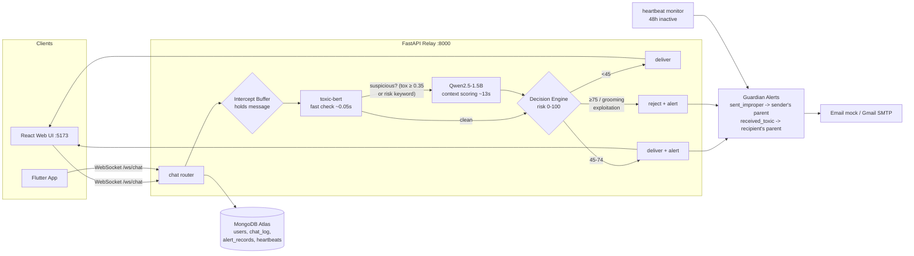

# Aegis — Intelligent Child Chat Guardian

**U23CS704 Mini Project — First Review**
Sona College of Technology | Department of CSE

**Team:**
- SAI RAJA RAJAN J K — CSE C, 4th Year (6178192102)
- SHALINI — CSE C, 4th Year (61782323102)

**Supervisor:** Dr. A.C. Kaladevi, ME, MCA, PhD

**Repo:** https://github.com/Sairajarajan/Mini_project

---

## Problem Statement (PS-14)

Design a system to detect **grooming patterns and child exploitation attempts** on social media
using language modeling, chat monitoring, and behavioral indicators — protecting children in an
increasingly connected world with proactive, **send-time** safety.

## What Aegis Does

- **Send-time interception** — messages are evaluated by AI *before* delivery to the recipient
- **Context-aware classification** — analyzes message intent + recent conversation history,
  not just isolated keywords
- **Guardian Alerts** — parents are notified by email only when a real threat exists:
  - Child **received** an inappropriate message → alert to child's parent (with message + sender)
  - Child **sent** an improper message → alert to sender's parent ("your child behaved improperly")
  - **Both parents alerted** on warn/block: e.g. Alice sends "I want to meet you alone" to Bob →
    Alice's parent gets `sent_improper` AND Bob's parent gets `received_toxic`
    ("Your child Bob received an inappropriate message from Alice...")
  - App **uninstalled/stopped** (no heartbeat for 48h) → warning email to parent
- **Privacy-preserving** — only alerts are sent, not full chat logs

## Architecture



Text equivalent:

```
Child Chat UI (React web / Flutter app)
        │  WebSocket
        ▼
FastAPI Relay ──> Intercept Buffer ──> Context Classifier ──> Decision Engine
        (holds message)    (toxic-bert fast check   (risk score 0-100)
                            + Qwen2.5 LLM context)       ├─ Safe     → deliver
                                                          ├─ Warn     → deliver + guardian alert
                                                          └─ Block    → reject + guardian alert
        │
        ▼
MongoDB Atlas (users, chat log, alert records, heartbeats)
        │
        ▼
Email Service (mock in dev → Gmail SMTP in production)
```

## Tech Stack

| Layer | Technology |
|---|---|
| Backend | Python 3.14, FastAPI, Uvicorn, WebSockets |
| AI/ML | PyTorch (CPU), Transformers, toxic-bert (BERT-6-label), Qwen2.5-1.5B-Instruct (LoRA fine-tune supported) |
| Database | MongoDB Atlas (Motor async driver) |
| Frontend (web) | React 18 + Vite (Sprint 3 ✅) |
| Frontend (mobile) | Flutter (code written, SDK install pending) |
| Auth | Google OAuth (planned, Sprint 3) |
| Email | Gmail SMTP (mock in dev) |

## Project Structure

```
backend/
├── app/
│   ├── main.py            # FastAPI entry point + lifespan (Mongo connect, heartbeat task)
│   ├── config.py          # env-based settings (.env) incl. model paths
│   ├── database.py        # Motor async MongoDB client
│   ├── models.py          # Pydantic schemas (User, Alert, Decision...)
│   ├── routers/
│   │   ├── users.py       # user upsert/get/list, heartbeat
│   │   ├── chat.py        # WebSocket relay + intercept buffer + history
│   │   └── alerts.py      # alert records listing (parent dashboard)
│   └── services/
│       ├── classifier.py  # toxic-bert fast check + Qwen2.5 context scoring (LoRA-ready)
│       ├── decision.py    # risk thresholds → deliver/warn/block
│       ├── email_service.py   # Mock/SMTP parent alert emails
│       └── heartbeat.py   # background 48h-inactivity monitor task
├── scripts/
│   ├── test_db.py             # MongoDB connectivity check
│   ├── test_classifier.py     # classify sample messages
│   ├── test_ws.py             # WebSocket end-to-end test (2 fake users)
│   ├── download_models.py     # fetch Qwen2.5 + toxic-bert from HF Hub
│   ├── download_data.py       # cyberbullying dataset + PAN12 (manual step)
│   └── train_lora.py          # LoRA fine-tune of Qwen (CPU-friendly)
├── data/                  # datasets (gitignored)
├── models/                # LLM weights — gitignored, see "Models" section
├── requirements.txt       # web deps
├── requirements-ml.txt    # ML deps (torch CPU, transformers, detoxify)
├── .env                   # secrets (gitignored) — copy from .env.example
└── .env.example
web/                       # React chat UI (Vite) — Sprint 3 ✅
├── src/App.jsx            # login + chat + parent alerts panel
├── vite.config.js         # proxies / and /ws to backend :8000
└── package.json
app/                       # Flutter mobile app — Sprint 3 (SDK install pending)
├── pubspec.yaml
└── lib/ (main.dart, api.dart, login_page.dart, chat_page.dart)
```

---

## Models (LLM weights — NOT in GitHub)

**Why not in the repo:** GitHub rejects files > 100 MB and flags repos > 1 GB.
The combined models are ~4.4 GB, so they are **gitignored** and must be downloaded once.

| # | Model | Size | Purpose |
|---|---|---|---|
| 1 | `Qwen/Qwen2.5-1.5B-Instruct` | ~3.2 GB | LLM context classifier (intent + risk score) |
| 2 | `unitary/toxic-bert` | ~1.3 GB | Fast toxicity check (BERT, 6-label) |

### Download (one of these)

**Option A — automated script (recommended):**

```powershell
cd backend
.\.venv\Scripts\python scripts\download_models.py
```

**Option B — HuggingFace CLI:**

```powershell
cd backend
.\.venv\Scripts\python -m pip install -U huggingface_hub

hf download Qwen/Qwen2.5-1.5B-Instruct --local-dir models\Qwen2.5-1.5B-Instruct
hf download unitary/toxic-bert          --local-dir models\toxic-bert
```

**Option C — manual browser download:**
- https://huggingface.co/Qwen/Qwen2.5-1.5B-Instruct → `models/Qwen2.5-1.5B-Instruct`
- https://huggingface.co/unitary/toxic-bert → `models/toxic-bert`

No auth token required — both are open models. Files must land in `backend/models/`
(the path is configurable via `QWEN_MODEL_PATH` / `TOXIC_BERT_PATH` in `.env`).

---

## Quick Start (all commands in order)

> Windows PowerShell. Python 3.13+, Node 20+, MongoDB Atlas URI required.

```powershell
# 1) Clone
git clone https://github.com/Sairajarajan/Mini_project.git
cd Mini_project

# 2) Backend environment
cd backend
python -m venv .venv
.\.venv\Scripts\python -m pip install --upgrade pip
.\.venv\Scripts\python -m pip install -r requirements.txt
.\.venv\Scripts\python -m pip install -r requirements-ml.txt
.\.venv\Scripts\python -m pip install email-validator

# 3) Secrets  (edit .env -> put your MONGODB_URI, keep EMAIL_MODE=mock for demo)
copy .env.example .env

# 4) Models (~4.4 GB, one-time download)
.\.venv\Scripts\python scripts\download_models.py

# 5) Verify DB
.\.venv\Scripts\python scripts\test_db.py        # expect: MongoDB ping: True

# 6) Start backend  (terminal 1)
.\.venv\Scripts\python -m uvicorn app.main:app --port 8000
#    Swagger docs: http://localhost:8000/docs

# 7) Start web chat UI  (terminal 2)
cd ..\web
npm install
npm run dev                                     # http://localhost:5173

# 8) Use it: open http://localhost:5173 in TWO browser tabs
#    tab 1 -> create "Alice" (parent.alice@test.com)
#    tab 2 -> create "Bob"   (parent.bob@test.com)
#    Alice -> Bob: "hi"                 -> badge "deliver · risk 0.1" (instant)
#    Alice -> Bob: "wanna meet at the park after school alone?"
#                                      -> badge "block · risk 95" + parent alerts on both sides

# 9) Optional tests
cd ..\backend
.\.venv\Scripts\python -m pip install pytest pytest-asyncio
.\.venv\Scripts\python -m pytest scripts\tests\test_core.py -q       # 14 unit tests
.\.venv\Scripts\python scripts\tests\test_e2e_ws.py                  # E2E (server running)
.\.venv\Scripts\python scripts\metrics.py                            # accuracy + latency report
```

**Alerts in demo mode (`EMAIL_MODE=mock`):** emails are printed to the backend terminal
instead of sent. Check the web UI "Parent alerts" panel, or
http://localhost:8000/alerts (and /alerts/{user_id}).

---

## Build & Run

### 1. Prerequisites
- Python 3.13+ (tested on 3.14)
- Node.js 20+ (for React web UI)
- Flutter 3.44+ (for mobile app — see "Flutter app" below)
- MongoDB Atlas free cluster (connection string in `.env`)
- Git

### 2. Backend setup

```bash
cd backend
python -m venv .venv
.venv\Scripts\activate                    # Windows
# or: source .venv/bin/activate           # Linux/macOS

pip install -r requirements.txt
pip install -r requirements-ml.txt
pip install email-validator               # pydantic EmailStr dependency
```

> Note: `requirements-ml.txt` pins PyTorch to the CPU build
> (`--index-url https://download.pytorch.org/whl/cpu`). For GPU, install torch from
> `https://download.pytorch.org/whl/cu124` instead.

### 3. Configure secrets

```bash
copy .env.example .env    # Windows
# cp .env.example .env    # Linux/macOS
```

Edit `.env`:
- `MONGODB_URI` — your Atlas connection string
- `EMAIL_MODE=mock` for dev (alerts logged to console); switch to `smtp` + set
  `EMAIL_SENDER` / `EMAIL_APP_PASSWORD` (Gmail App Password) for real emails
- Risk thresholds: `RISK_THRESHOLD_WARN=45`, `RISK_THRESHOLD_BLOCK=75`
- `USE_LLM=true` — toggle the Qwen2.5 context classifier on/off
- `USE_LORA=true` — attach trained LoRA adapter at `models/lora-aegis` (after `train_lora.py`)
- `CASCADE=true` — fast path: toxic-bert + risk keywords first; the Qwen LLM runs only for
  suspicious messages. **This is the speed optimization** (normal chat ~0.1-0.2 s vs ~10 s)
- `LLM_TRIGGER_TOXICITY=0.35` — toxicity score that forces the LLM check
- `QWEN_MAX_NEW_TOKENS=56` / `QWEN_MAX_INPUT_TOKENS=256` — LLM generation budget

### 4. Download models (once)

See the [Models](#models-llm-weights--not-in-github) section above. ~4.4 GB total.

### 5. Verify MongoDB

```bash
.venv\Scripts\python scripts\test_db.py    # expect: MongoDB ping: True
```

### 6. Run the API

```bash
.venv\Scripts\python -m uvicorn app.main:app --reload --port 8000
```

- Health check: http://localhost:8000/health
- API docs (Swagger): http://localhost:8000/docs

### 7. Run the React web chat UI

```bash
cd web
npm install
npm run dev        # http://localhost:5173  (proxies / and /ws to :8000)
```

Open two browser tabs, create/pick two profiles, chat — Aegis intercepts each message
and shows `deliver / warn / block` badges with the risk score. The "Parent alerts"
panel lists alert emails for the current profile.

### 8. Tests

```bash
.\.venv\Scripts\python scripts\test_classifier.py   # classifier smoke test
.\.venv\Scripts\python scripts\test_ws.py           # WebSocket E2E (Alice→Bob)
```

---

## API Endpoints

| Method | Path | Purpose |
|---|---|---|
| GET | `/health` | status + DB ping |
| GET | `/config` | current thresholds + model paths |
| POST | `/users/upsert` | create/update child profile (name, parent_email) |
| GET | `/users` | list all profiles (contact picker) |
| GET | `/users/{user_id}` | fetch user |
| POST | `/users/heartbeat?user_id=` | record app heartbeat (anti-uninstall) |
| WS | `/ws/chat?user_id=` | chat relay — send `{"type":"message","recipient_id":"...","text":"..."}` |
| GET | `/chat/history/{user_id}/{other_id}` | last 100 messages between two users |
| GET | `/alerts` | all alert records (parent dashboard) |
| GET | `/alerts/{user_id}` | alerts for one child |

**Decision flow:** every sent message → intercept buffer → toxic-bert (fast) + Qwen2.5
(context) → `risk_score` 0-100 → **deliver** (<45) | **warn** (45-74, delivered + parent
email) | **block** (≥75 or grooming/exploitation intent, rejected + parent email).

---

## Sprint Progress Log

### Sprint 1 ✅ — Backend skeleton
FastAPI + lifespan, Motor MongoDB client, Pydantic models, mock/SMTP email service,
`.env.example`, `test_db.py`, README.

### Sprint 2 ✅ — Context classifier + decision engine + chat relay
- `classifier.py`: toxic-bert fast check **loaded directly via Transformers**
  (Detoxify's `checkpoint=` arg expects its proprietary `.ckpt` format — it rejected the
  downloaded HF directory with `Permission denied`; toxic-bert is a standard
  `BertForSequenceClassification` with 6 toxicity labels, so we load it with
  `AutoModelForSequenceClassification` and take `sigmoid(logits)` — same math, fully offline)
- `classifier.py`: Qwen2.5-1.5B-Instruct scored via chat-template + JSON answer
  (`{"intent","risk_score","reason"}`), lazily loaded in a worker thread, cascade design
  (LLM skipped when `USE_LLM=false`; falls back to `toxicity * 100`)
- `decision.py`: thresholds → deliver/warn/block; `grooming`/`exploitation` always block
- `chat.py`: WebSocket relay with intercept buffer, chat history context (last 8 msgs),
  alert records persisted to Mongo
- `heartbeat.py`: background 48h-inactivity → parent warning email
- Scripts: `download_models.py`, `test_classifier.py`, `test_ws.py`
- Verified E2E: "Hi Bob" → deliver (risk 0.1); "Wanna meet at the park after school,
  just you and me, alone?" → **block** (risk 85, grooming), Bob receives nothing,
  alert record + mock email created.

### Sprint 3 (in progress) — Clients
- ✅ React web chat UI (`web/`): login/profile picker, contacts, WebSocket chat with
  deliver/warn/block badges + risk score, parent alerts panel, 60s heartbeat
- ⏳ Flutter app: code written (`app/lib/`), needs Flutter SDK (see below)
- ⏳ Google OAuth: needs a Google Cloud OAuth client (see "OAuth setup" below)

### Sprint 3.5 ✅ — Inference speed (cascade)
- **Problem:** every message ran Qwen2.5-1.5B on CPU → 9-20 s per message, even "hi".
- **Fix (cascade):** toxic-bert fast check + 40 risk keywords first. The LLM only runs
  when toxicity ≥ 0.35 OR a risk pattern matches. Result:
  - normal chat ("hi", "how are you?", memes): **0.1-0.2 s**
  - suspicious messages ("meet at park alone", "send me photos"): ~8.7 s (LLM, blocked)
- **Truncation fix:** with 40 max_new_tokens the LLM's JSON got cut mid-reason and the
  message fell through as safe. Fixed: token budget → 56, regex fallback parsing
  (`"intent"`, `"risk_score"`, `"reason"` extracted even from truncated JSON), and a
  **fail-safe** — if the LLM was triggered but output is unparseable, risk is raised to
  at least the warn threshold (never silently delivered).
- **Warm-up:** models now preload in the background at server startup (`preload()`),
  so the first message doesn't pay the ~20 s model-load penalty.
- **For even faster LLM checks** (optional): switch to the 0.5B model —
  `hf download Qwen/Qwen2.5-0.5B-Instruct --local-dir models\Qwen2.5-0.5B-Instruct`
  then set `QWEN_MODEL_PATH=models\Qwen2.5-0.5B-Instruct` in `.env` (~2-4 s per LLM check).
- Measured with `scripts/test_speed.py`.

### Sprint 3.6 ✅ — Recipient parent alert
- On warn/block, the **recipient's parent** is now also emailed (`received_toxic`):
  "Your child Bob received an inappropriate message from Alice" + message + reason.
  Sender's parent still gets `sent_improper` as before. Both alerts are stored in
  `alert_records` and visible per-child in the web UI "Parent alerts" panel.
- The email text distinguishes **blocked** ("Aegis blocked this message before delivery")
  from **warn** ("flagged and delivered") via the `blocked` context flag.

### Sprint 4 ✅ — Tests + metrics + docs
- **Unit tests** (`scripts/tests/test_core.py`): decision engine thresholds, intent
  gating, cascade fast path, toxic + grooming detection. `14 passed`.
- **E2E WebSocket test** (`scripts/tests/test_e2e_ws.py`, needs running server):
  safe message delivered, grooming blocked, alerts on BOTH parents. `5 passed`.
- **Metrics** (`scripts/metrics.py`) on 16 labeled samples:

  | Metric | Result |
  |---|---|
  | Accuracy | **100%** (16/16) |
  | Unsafe detected (TP) | 10 |
  | Missed (FN) | 0 |
  | False alerts (FP) | 0 |
  | Fast path latency (median) | **0.05 s** |
  | LLM path latency (median) | ~15 s (CPU; ~2-4 s with 0.5B model) |
- **Architecture diagram**: mermaid version added at the top (renders on GitHub).
- Fix: keyword "school" was too broad (flagged "how was your day at school?");
  narrowed to "your school / which school / school name" → FP eliminated.

### Sprint 4 — remaining
Update the PPTX slide deck with live metrics + architecture diagram; final
review checklist. `test_e2e_ws.py` cleanup uses `DELETE /users/{user_id}`.

---

## Commands Used (development log)

### Environment setup
```powershell
python --version                                    # 3.14.5
python -m venv .venv
.\.venv\Scripts\python -m pip install --upgrade pip
.\.venv\Scripts\python -m pip install -r requirements.txt
.\.venv\Scripts\python -m pip install -r requirements-ml.txt
.\.venv\Scripts\python -m pip install email-validator
python -m pip index versions torch --index-url https://download.pytorch.org/whl/cpu   # 2.13.0+cpu
```

### Model downloads
```powershell
python -m pip install -U huggingface_hub
hf download Qwen/Qwen2.5-1.5B-Instruct --local-dir models\Qwen2.5-1.5B-Instruct
hf download unitary/toxic-bert          --local-dir models\toxic-bert
.\.venv\Scripts\python scripts\download_models.py     # equivalent one-command
```

### Dataset + fine-tune
```powershell
.\.venv\Scripts\python scripts\download_data.py          # cyberbullying CSV + PAN12 attempt
.\.venv\Scripts\python scripts\train_lora.py --samples 2000
```

### Run + test
```powershell
.\.venv\Scripts\python -m uvicorn app.main:app --reload --port 8000
.\.venv\Scripts\python scripts\test_db.py
.\.venv\Scripts\python scripts\test_classifier.py
.\.venv\Scripts\python scripts\test_ws.py
.\.venv\Scripts\python scripts\test_speed.py        # cascade latency check
cd web; npm install; npm run dev
```

### Git workflow for this repo
```powershell
git init
git add .
git commit -m "message"
git branch -M main
git remote add origin https://github.com/Sairajarajan/Mini_project.git
git push -u origin main
# after remote changes:
git pull --rebase origin main
git push
```

---

## Known Notes / Decisions

- **`from ..database import db` bug (fixed):** routers imported the `db` global *by value*,
  so `connect_db()` rebinding `database.db` was invisible to them (`NoneType` errors).
  Routers now use `from .. import database` and access `database.db.*` dynamically.
- **ObjectId serialization:** Mongo docs returned by `/alerts` and `/chat/history` were
  not JSON-serializable (`ObjectId`); alert docs now convert `_id` → str, history drops `_id`.
- **Timezone bug (fixed):** PyMongo returns datetimes as *naive UTC* (BSON has no tzinfo),
  so the API sent `09:03` with no offset and browsers treated it as local time — alerts
  appeared ~5.5h early (UTC shown as local). All routers now stamp naive datetimes as
  UTC (`replace(tzinfo=timezone.utc)`) before returning, so the UI converts to local time.
- **LLM fallback:** if Qwen is missing (`USE_LLM=false`), the system still works —
  risk score degrades to `toxicity * 100`.
- **Intent gating:** `grooming` / `exploitation` intents always block, regardless of
  numeric score.
- First Qwen inference takes ~20 s on CPU (model load); subsequent messages ~9-11 s.
  Consider a smaller model or batching for production.
- `.env` is gitignored — **never commit** your MongoDB URI / Gmail app password.

## Flutter app (mobile)

The Flutter client is written (`app/`) but the SDK is not installed on the dev machine.
To run it:

```powershell
# 1. Install Flutter SDK (https://docs.flutter.dev/get-started/install/windows)
# 2. Scaffold platform folders + build
cd app
flutter create .          # generates android/ ios/ windows/ etc.
flutter pub get
flutter run               # Windows desktop, or an emulator/device
```

Change `AegisApi.base` in `app/lib/api.dart` to `http://10.0.2.2:8000`
for the Android emulator.

## Google OAuth (Sprint 3, pending)

1. Create an OAuth client at https://console.cloud.google.com/apis/credentials
   (redirect URI `http://localhost:8000/auth/callback`)
2. Put `GOOGLE_CLIENT_ID` / `GOOGLE_CLIENT_SECRET` in `.env`
3. Backend `/auth/login` + `/auth/callback` endpoints and a "Sign in with Google"
   button in both clients are the remaining work.

## Sprint Roadmap

| Sprint | Deliverable | Status |
|---|---|---|
| 1 | Backend skeleton, MongoDB, email service, dataset, toxic-bert baseline | ✅ done |
| 2 | Qwen2.5 LLM context classifier, decision engine, chat WebSocket relay | ✅ done |
| 3 | React web chat + Flutter app, Google OAuth login | 🔶 in progress (web ✅, Flutter code ✅, OAuth pending) |
| 4 | E2E tests, metrics, architecture diagram, final docs + PPTX | 🔶 in progress (tests ✅ metrics ✅ diagram ✅, PPTX pending) |

## Roadmap Extras

- LoRA fine-tune `Qwen2.5-1.5B-Instruct` on PAN12 grooming data for intent classes:
  neutral / grooming / exploitation / explicit (`scripts/train_lora.py`)
- Guardian alert dashboard for parents
- Chat history analytics (aggregate, privacy-preserving)